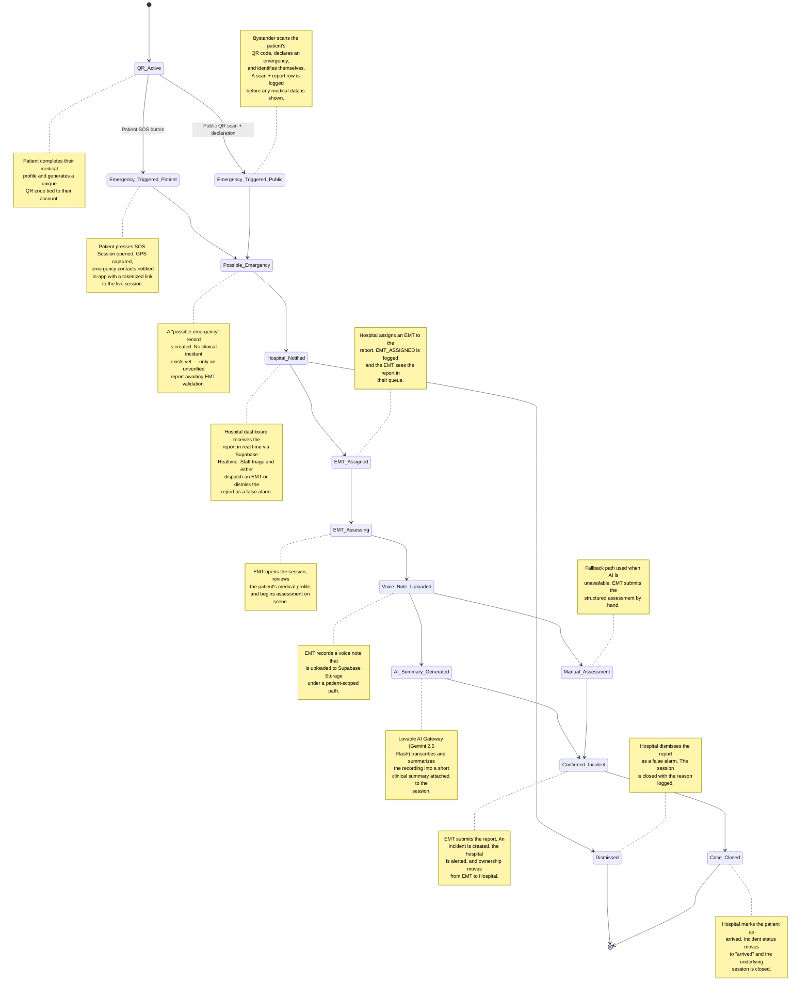
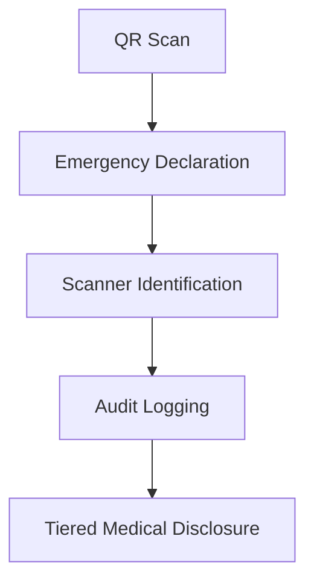
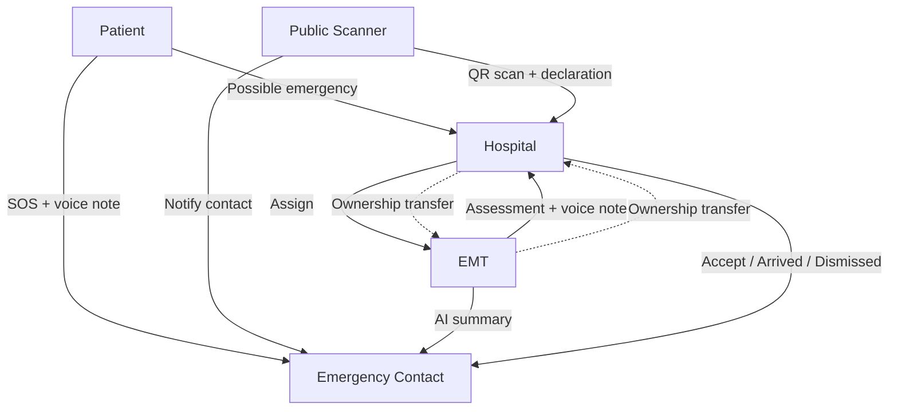

# Savitri Guardian — Incident Lifecycle

This document describes the complete emergency response lifecycle as currently implemented in the Savitri Guardian MVP. Every state, audit event, and notification described here maps to verified code in this repository.

## Purpose

- Hackathon judges — trace every state transition in the emergency chain
- Recruiters & product leaders — understand the business flow at a glance
- Healthcare operators — see where audit, notification, and handoff events occur
- Investors — see how AI-assisted triage reduces time-to-clinical-context

---

## 1. State Diagram

---

## 2. Two Entry Points

Savitri Guardian has two — and only two — ways an emergency lifecycle begins. They are deliberately distinct and both are visible above.

### Path A — Patient SOS

- **Initiated by:** the patient, from their own device
- **Captures:** GPS coordinates (with explicit failure logging when denied)
- **Records:** an optional SOS voice note from the patient
- **Notifies:** all emergency contacts in-app with a tokenized notification link
- **Audit:** `SOS_TRIGGERED`, `LOCATION_CAPTURED` (or `LOCATION_CAPTURE_FAILED`), `SOS_NOTIFICATION_SENT`, `VOICE_RECORDING_STARTED`, `VOICE_RECORDING_UPLOADED`

### Path B — Public QR Scan

- **Initiated by:** a third-party bystander scanning the patient's QR code
- **Requires:** an explicit emergency declaration before any medical data is shown
- **Requires:** scanner identification (name + contact)
- **Triggers:** a "possible emergency" report routed to the hospital dashboard
- **Audit:** `QR_SCANNED`, `PUBLIC_EMERGENCY_REPORTED`, `MEDICAL_INFO_DISCLOSED`, `CONTACT_NOTIFIED`

These two paths converge at **Possible Emergency** but stay independently auditable end-to-end.

---

## 3. Privacy-Preserving Medical Disclosure

Disclosure of sensitive medical information is gated, not automatic. This is a core Savitri design principle.

- **Step 1 — QR Scan:** scanning the code alone reveals nothing clinical.
- **Step 2 — Emergency Declaration:** the scanner must explicitly declare an emergency before medical fields are surfaced.
- **Step 3 — Scanner Identification:** the scanner provides a name and contact; identity is recorded with the report.
- **Step 4 — Audit Logging:** `QR_SCANNED`, `PUBLIC_EMERGENCY_REPORTED`, and `MEDICAL_INFO_DISCLOSED` are written before any patient data is returned to the client.
- **Step 5 — Tiered Disclosure:** only the fields required for first response (ICE contacts, allergies, blood group, critical conditions) are shown — never the full record.

EMT and hospital users follow the same gate via `EMT_ACCESS_GRANTED` and `HOSPITAL_ACCESS_GRANTED`, with their role-based access recorded against the session.

---

## 4. Emergency Contact Experience

When a patient triggers SOS, every emergency contact receives an in-app notification carrying a tokenized URL (`/n/:token`) to a portal scoped to that one session.

### Capabilities

- **Live incident timeline** assembled from audit events for the session
- **Patient SOS voice note playback** with `VOICE_NOTE_PLAYED` logged on each play
- **EMT assessment voice note playback** once the EMT has uploaded one
- **AI summary viewing** when Gemini has produced a summary
- **Status updates** as the session moves from open → submitted → accepted → arrived → closed
- **Hospital assignment visibility** once a hospital accepts the case (including the assigned registration number stored on the incident)

The portal updates as the session progresses, so the emergency contact stays informed from the first SOS through arrival at the hospital, without needing the patient app or any account of their own.

---

## 5. Audit Coverage

Only audit actions that exist in the current codebase are listed.

| Transition / Event | Audit Action | Side Effects |
|---|---|---|
| Patient presses SOS | `SOS_TRIGGERED` | Session opened with `status=open` |
| GPS captured on SOS | `LOCATION_CAPTURED` | Coordinates and accuracy attached to session |
| GPS denied or unavailable on SOS | `LOCATION_CAPTURE_FAILED` | Failure reason recorded against the session |
| Emergency contact notified by SOS | `SOS_NOTIFICATION_SENT` / `CONTACT_NOTIFIED` | In-app notification row inserted with tokenized link |
| Patient voice note recorded / uploaded | `VOICE_RECORDING_STARTED`, `VOICE_RECORDING_UPLOADED` | Audio stored in Supabase Storage; session `voice_note_path` set |
| Contact plays voice note | `VOICE_NOTE_PLAYED` | Recorded against the session for the contact portal |
| Public QR scanned | `QR_SCANNED` | Read-only scan logged before any disclosure |
| Public scanner files report | `PUBLIC_EMERGENCY_REPORTED` | Report routed to hospital dashboard |
| Medical info disclosed to scanner | `MEDICAL_INFO_DISCLOSED` | Tiered fields released after declaration + identification |
| EMT scans patient QR | `EMT_ACCESS_GRANTED`, `EMERGENCY_SESSION_CREATED` | EMT session opened for assessment |
| Hospital opens patient QR | `HOSPITAL_ACCESS_GRANTED` | Hospital-side access logged |
| Hospital assigns EMT | `EMT_ASSIGNED` | EMT receives the dispatch in their queue |
| EMT submits assessment | `REPORT_SUBMITTED`, `HOSPITAL_ALERTED` | Incident created; hospital notified in real time |
| Hospital accepts incident | `HOSPITAL_ACCEPTED` | Incident `status=accepted`; registration number assigned |
| Hospital marks patient arrived | `PATIENT_ARRIVED` | Incident `status=arrived`; underlying session closed |
| Hospital dismisses report | `HOSPITAL_DISMISSED_REPORT` | Report closed with reason logged |
| Patient profile updated | `PROFILE_UPDATED` | Medical fields versioned via audit |
| Patient QR generated | `QR_GENERATED` | New token recorded |

Case closure and dismissal are reflected as **status transitions on the incident and session rows** (`status=arrived`, `status=closed`) rather than as a separate `CASE_CLOSED` audit action.

---

## 6. Notification Fan-Out

State changes that affect patient condition or routing broadcast to three audiences:

1. **Emergency Contacts** — via in-app notifications updated in real time on the `/n/:token` portal
2. **Hospital Dashboard** — via Supabase Realtime `postgres_changes` subscriptions
3. **Audit Log** — immutable append-only record for compliance and post-incident review

---

## 7. Ownership Handoff

- **Patient** owns the session at creation (`SOS` or after a public report references their profile).
- **EMT** owns the case from `EMT Assigned` through `Confirmed Incident` (submission of the assessment).
- **Hospital** owns the case from `Confirmed Incident` through `Case Closed`.
- **Emergency contacts** retain read access to the specific session they were notified about via their token.

---

## 8. Stakeholder Interaction (Business View)

Across this graph:

- **Notifications** travel from Patient/Scanner outward to Contacts and Hospital.
- **Voice notes** are produced by both Patient (SOS) and EMT (assessment).
- **AI summaries** flow from EMT-recorded audio to Hospital and Contact views.
- **Audit events** are written by every actor at every transition.
- **Ownership transfer** moves the case from EMT to Hospital at confirmation.

---

## 9. Session Terminal States

A session ends in exactly one of two terminal states:

- **Case Closed** — incident reached `status=arrived` and session reached `status=closed`
- **Dismissed** — hospital dismissed the report as a false alarm; session closed with reason logged

---

*See also: `ARCHITECTURE.md` for system diagrams, `README.md` for project overview.*
