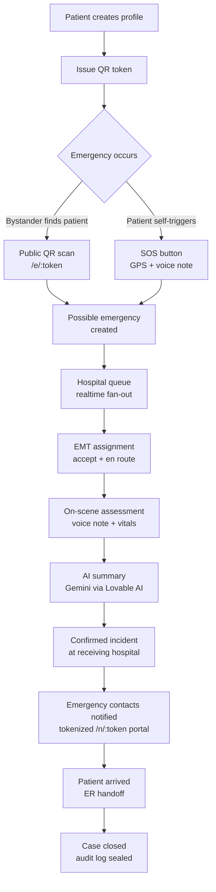
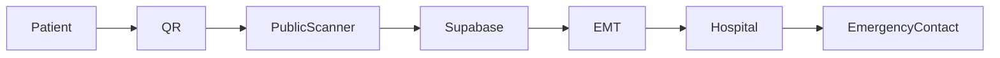

# Savitri Guardian

**A QR-driven emergency response platform that turns any bystander, EMT, or hospital into the first link in a patient's chain of survival — in seconds, not minutes.**

---

## The Problem

When a person collapses, crashes, or is found unconscious in a public place, the first ten minutes — the so-called *platinum ten* — decide whether they live, recover, or suffer permanent damage. Today, those ten minutes are wasted on questions nobody can answer:

- **Unknown identity.** Bystanders don't know who the person is. Wallets get lost, phones are locked, ICE contacts are buried inside a passcode-protected screen.
- **Unknown medical conditions.** Paramedics arrive blind: no allergies, no blood group, no current medications, no implants, no DNR status. Wrong drug, wrong dose, wrong assumption.
- **Delayed emergency response.** Bystanders don't know which hospital to call, what to say, or how to describe the location. The ambulance is dispatched late, and the receiving ER has no warning.
- **Family not informed.** Loved ones learn what happened from a phone call hours later — long after critical decisions have already been made on their behalf.

The information exists. It just isn't reachable when it matters most.

---

## The Solution

**Savitri Guardian** is a secure, QR-driven bridge between patients, public bystanders, EMTs, and hospitals. The patient carries a single QR code (printed, sticker, wristband, phone wallpaper). Everyone else gets exactly the access they need — and nothing more.

- **QR-based emergency identity.** The QR encodes only a rotating token. Scan it and a public emergency portal opens — no app install, no login. Allergies, blood group, ICE contacts, and a pre-filled "report this emergency" button appear instantly. PII stays server-side and is gated by the token.
- **Emergency response coordination.** A scan or an SOS tap creates a live *session* that fans out in realtime to the nearest hospital queue and to the patient's emergency contacts.
- **EMT workflow.** EMTs scan, see the medical profile, capture a voice note from the scene, run a structured assessment, and hand the case off to a hospital — all from a phone.
- **Hospital workflow.** Hospitals see *possible* emergencies the moment a public scan happens, *confirmed* incidents the moment an EMT accepts, and a live timeline through patient arrival.
- **Emergency contact workflow.** Family receives a tokenized link (no account needed) showing live status, location, hospital assignment, and voice notes as they happen.
- **AI-assisted triage.** Voice notes are transcribed and summarized by Gemini via the Lovable AI Gateway into a structured handoff brief, so the ER team is briefed before the ambulance backs into the bay.

---

## MVP Metrics

- 4 stakeholder workflows
- 13 end-to-end workflow validations passed
- QR scan to emergency report: < 30 seconds
- Real-time hospital notification delivery
- AI-generated EMT handoff summaries
- Audit trail for all critical actions

---
## Core Features

### Patient
- Medical profile (allergies, conditions, medications, blood group, implants, DNR)
- Emergency contacts with relationship + priority
- One-tap SOS with GPS + optional voice note
- Rotating QR identity (old QR is revoked on reissue)

### Public Scanner
- Zero-install emergency reporting from a phone camera
- Privacy-preserving disclosure: ICE + critical medical only, no PII dump
- One tap to call 112 / dispatch local emergency services

### EMT
- Scan-to-assess in under 5 seconds
- Structured on-scene assessment with quality gates
- Voice recording uploaded straight to secure storage
- AI summary auto-generated for hospital handoff

### Hospital
- *Possible emergencies* board (public scans, unconfirmed)
- *Confirmed incidents* board (EMT-accepted, en route)
- EMT assignment, priority, and registration number tracking
- Live patient timeline through arrival and case closure

### Emergency Contact
- Tokenized portal — no account, no app
- Live status, hospital, and ETA updates
- Voice notes from the scene as they're recorded
- Full status tracking from scan → arrived → closed

---

## End-to-End Workflow



---

## High-Level Architecture


---

## Architecture

See [ARCHITECTURE.md](./ARCHITECTURE.md) for the full system diagram, sequence diagrams (SOS, public scan, EMT handoff), the database ERD, and the security architecture.

---

## Technology Stack

- **React 19** — UI runtime
- **TanStack Start v1 + TanStack Router + TanStack Query** — full-stack framework, type-safe routing, server functions (`createServerFn`)
- **Supabase** — Postgres + Row Level Security, Auth (JWT), Storage (voice notes), Realtime (notification fan-out)
- **Cloudflare Workers** — edge runtime for SSR and server functions
- **Gemini 2.5 Flash via Lovable AI Gateway** — multimodal voice-note transcription and triage summarization
- **Tailwind CSS v4 + shadcn/ui** — design system
- **TypeScript (strict)** — end-to-end type safety
- **Vite 7** — build tooling
- **Zod** — runtime input validation on every server function and public route

---

## Security

- **Row Level Security (RLS)** on every public-schema table; multi-tenant scoping via `tenant_id` and `auth.uid()`-based policies. Roles stored in a dedicated `user_roles` table with a `SECURITY DEFINER` `has_role()` function — never on the profile.
- **JWT authentication** via Supabase Auth. Server functions are gated by a `requireSupabaseAuth` middleware that validates the bearer token and exposes a per-user Supabase client (RLS applies as the user).
- **Audit logs** for every privileged action (token issuance, scan, EMT assignment, status change), written via the service-role admin client.
- **Tokenized public access** for bystanders (`/e/:token`) and emergency contacts (`/n/:token`) — no PII in the URL, tokens are rotatable and revocable, no account required.
- **Secret management** via Lovable Cloud secrets. `.env` is gitignored, `.env.example` is committed as a template. Service-role keys are server-only (`client.server.ts`) and never imported into client code.
- **Input validation** with Zod on every server function and public API route, including length, format, and range bounds to harden against malformed input and DoS.

---

## Demo

A guided judge walkthrough (≈3 minutes), end-to-end on one laptop + one phone:

1. **Patient** signs up, fills the medical profile, and generates a QR.
2. **Bystander** (phone camera) scans the QR → public emergency page loads with ICE + critical medical, taps *Report Emergency*.
3. **Hospital dashboard** lights up with a *possible emergency*; the on-call **EMT** sees it on their phone and accepts.
4. **EMT** records a 10-second voice note on scene. Gemini transcribes and summarizes it into a structured handoff brief.
5. **Emergency contact** opens the tokenized link from their phone and sees live status, hospital, and the voice note as it lands.
6. **Hospital** marks the patient as *arrived* and closes the case. Audit log is sealed.

Demo Mode (`VITE_SAVITRI_DEMO_MODE=true`, on by default) uses a fixed Delhi location and skips real PSTN / SMS so judging never depends on a third-party provider.

---

## Roadmap

**MVP (now)**
- Patient profile + rotating QR
- Public scan + SOS
- EMT scan-to-assess with voice + AI summary
- Hospital possible / confirmed dashboards
- Tokenized emergency contact portal
- RLS, audit logs, demo mode

**Toward production**
- Real SMS / WhatsApp / voice-call dispatch for ICE notifications
- Native ambulance dispatch integration (govt 112 + private fleets)
- Wearable + smartwatch SOS (Apple Health, Google Health Connect)
- Hospital EHR push (FHIR) for confirmed incidents
- Offline-first EMT app with background sync
- Multi-language voice transcription
- SOC 2 + HIPAA-equivalent compliance hardening
- Pilot deployments with a city EMS and a hospital network

---

## Repository Structure

```
.
├── src/
│   ├── routes/                 # TanStack Router file-based routes
│   │   ├── __root.tsx          # App shell
│   │   ├── index.tsx           # Landing page
│   │   ├── patient/            # Patient app (profile, QR, SOS, session)
│   │   ├── emt/                # EMT app (scan, session)
│   │   ├── hospital/           # Hospital dashboard + incident view
│   │   ├── e.$token.tsx        # Public emergency portal (bystander)
│   │   ├── n.$token.tsx        # Emergency contact portal
│   │   └── api/public/         # Public HTTP endpoints (seed, demo-reset)
│   ├── lib/
│   │   ├── *.functions.ts      # TanStack server functions (createServerFn)
│   │   ├── *.server.ts         # Server-only helpers (voice notes, config)
│   │   ├── auth-context.tsx    # Client auth context
│   │   └── demo-mode.ts        # Demo-mode flags + safe defaults
│   ├── components/             # UI components (AppShell, SosHoldButton, …)
│   │   └── ui/                 # shadcn/ui primitives
│   ├── integrations/supabase/  # Auto-generated clients + middleware
│   └── styles.css              # Tailwind v4 + semantic design tokens
├── supabase/
│   ├── config.toml             # Project config
│   └── migrations/             # SQL migrations (tables, RLS, grants)
├── scripts/                    # SSR smoke + e2e test scripts
├── ARCHITECTURE.md             # System diagrams, ERD, security architecture
├── .env.example                # Required env vars (no secrets)
└── README.md
```

---

## License

_TBD — license to be added before public release._
